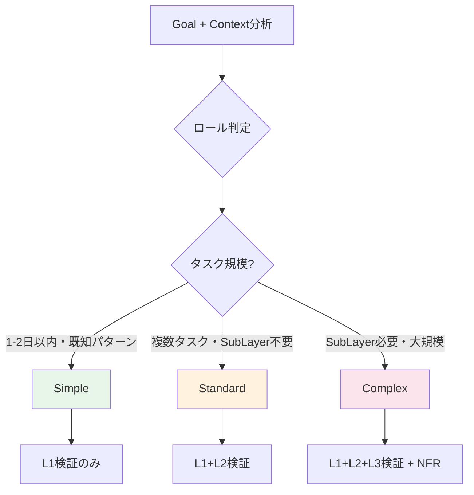

> 🏷️ **Project:** [Project Palma](N/A (Project Palma - Notion))

  **Type:** rule

  **Context:** AI-PLC Adaptive Workflow + Next Action判定ルール。Claude Code の `.claude/rules/workflow.md` に相当。ワークフロー深度判定・次アクション自動提案・モード判定を統合。

---

## 概要

> 🎯 **Claude Code対応:** `.claude/rules/workflow.md`


  **旧AIPO対応:** [Untitled](https://www.notion.so/bcd656e03a3b45aa9c158fb09c88d835) + AI-DLC由来の深度判定


  **役割:** Adaptive Workflow深度判定 + Next Action自動提案


  **ロード方式:** 自動（RUL_plc_systemから参照）

---

## 1. Adaptive Workflow深度判定（全PJ共通）

SKL_plc_01_collection（Stage 1）で自動判定される3段階の深度。**コーディングPJだけでなく、企画・コンテンツ・イベント等全タスクに適用。**検証ステップ（RUL_plc_system §18）と連動する。

| 深度 | 汎用判定条件 | パイプライン挙動 | 検証 Level |
| --- | --- | --- | --- |
| Simple | 単一タスク・明確なゴール・既知パターン・1-2日以内 | Stage 1→4直行（Stage 2-3スキップ） | L1のみ |
| Standard | 複数タスク・タスク分解が必要・SubLayerなし | 全4ステージを順次実行 | L1+L2 |
| Complex | 再帰的分解が必要・SubLayer生成・チーム連携 | 全4ステージ + SubLayer再帰 + NFRフル検証 | L1+L2+L3 |

**正規化ルール:** workflow_depthは必ず `simple` / `standard` / `complex` の3値のいずれか。内部思考で別の表現（"multi", "basic"等）を使っても、出力・記録は正規値のみ。

**Adaptive Skipログ必須:** Simple深度でStage 2-3をスキップする場合、backlog.yamlの`refactoring_log`（または初回ならintent.yamlのメモ）にスキップ理由を記録すること。暗黙的なスキップは禁止。

### ロール別深度判定基準

| ロール | Simple | Standard | Complex |
| --- | --- | --- | --- |
| product_manager | フィードバック収集・定例レポート | 機能企画・UX改善 | 新規事業・大規模ピボット |
| system_architect | 既存DBにプロパティ追加 | 新規DB設計・Notion構築 | システム全体アーキテクチャ |
| tech_lead | 単純バグ修正・1ファイル変更 | 機能追加・中規模変更 | 新サービス・アーキテクチャ変更 |
| developer | バグ修正・ドキュメント修正 | 機能実装・複数ファイル変更 | 大規模リファクタリング |
| content_strategist | SNS投稿・定型メール | ブログ記事・プレゼン | 書籍・ホワイトペーパー・シリーズ物 |
| generic | 単純な作業・即実行可能 | 複数ステップが必要 | 大規模・未知の領域 |

### 判定フロー



---

## 2. モード判定

SKL_plc_01_collection実行時にGoalの性質から自動判定。

| モード | 条件 | パイプライン挙動 |
| --- | --- | --- |
| Direct Mode | 一度きりの実行（設計書、分析、調査等） | Stage 1-4で完了。Stage 5なし |
| Platform Builder Mode | 繰り返し実行する仕組みを構築 | Stage 1-5全実行。Stage 4でProduction Skill自動生成→Stage 5で量産 |

---

## 3. Next Action自動提案

各スキル完了時に次のアクションを自動判定し提案する。

### 判定ルール

| 現在の状態 | Next Action | 提案文 |
| --- | --- | --- |
| Stage 1完了 | Stage 2（Inception）へ | 「SKL_plc_02_inception を実行してBacklogを作成しましょう」 |
| Stage 2完了 | Stage 3（Construction）へ | 「SKL_plc_03_construction を実行してSkillsを作成しましょう」 |
| Stage 3完了 | Stage 4（Operation）へ | 「SKL_plc_04_operation を実行してタスクを実行しましょう」 |
| Stage 4タスク完了（残あり） | Stage 4ループ | 「次の実行可能タスクはTXXXです」 |
| Stage 4全完了（Direct） | パイプライン終了 | 「全タスク完了。パイプラインを終了します」 |
| Stage 4全完了（Platform Builder） | Stage 5へ | 「Production Skillが生成されました。Stage 5で量産を開始しましょう」 |
| Reinit検出 | Stage 1（Update mode） | 「既存Layerを検出。Update modeで再初期化します」 |

### Next Step Options提示

各ステージ完了後、以下の形式でNext Step Optionsを提示：

> 🔜 **Next Step Options:**

  1. **[推奨]** [次のステージ/タスク]
  1. [代替アクション]
  1. セッション終了（進捗保存済み）

---

## 4. Focus Strategy（視点選択）

Stage 1でGoalの性質から自動判定し、最適なRoleを選択。Roles/配下のテンプレートから読み込む。

| Goal性質 | 推奨Role | 判定キーワード |
| --- | --- | --- |
| プロダクト開発 | ROL_plc_product_manager | 機能、UX、ユーザー、プロダクト |
| システム構築 | ROL_plc_system_architect | DB、API、アーキテクチャ、設計 |
| コンテンツ制作 | ROL_plc_content_strategist | 記事、ブログ、ライティング |
| その他 | ROL_plc_generic | （上記に該当しない） |

---

## 旧CTX対応表

| RUL_plc_adaptive | 旧AIPO | 変更内容 |
| --- | --- | --- |
| Adaptive Workflow深度判定 | AI-DLC由来（新規） | 新規。Simple/Standard/Complex 3段階 |
| モード判定 | layer.yamlのmode | Direct / Platform Builder に明確化 |
| Next Action自動提案 | CTX_next_action_rules | Stage名・SKL名をモダン用語に更新 |
| Focus Strategy | CTX_roles_templates（判定ロジック部分） | 判定ルールのみ。テンプレート本体はRoles/に分離 |

---

## 5. Adaptive Direction — Mid-Pipeline Backtrack

> 🔄 **AI-PLCのAdaptive第3軸: パイプライン進行方向の動的変更**

AI-DLCの「Adaptive Breadth（幅の適応）+ Adaptive Depth（深度の適応）」に加え、AI-PLCは**Adaptive Direction（方向の適応）**を導入する。パイプライン進行中にコンテキストに基づいてバックトラック（前ステージへの戻り）をAIが検知・提案する仕組み。

```
AI-PLCの3つのAdaptive軸:
- Adaptive Breadth: ステージのスキップ/選択 (Simple → Stage 1→4直行)
- Adaptive Depth:   各ステージ内の実行深度 (L1/L2/L3)
- Adaptive Direction: パイプライン進行方向の動的変更 (Backtrack)
```

### 5.1 Backtrack Trigger条件マトリクス

| ID | トリガー名 | 検知タイミング | 検知条件 | 提案アクション | 戻り先 |
|---|---|---|---|---|---|
| BT-1 | **Blocker Detection** | Phase 5.5b | L1/L2でcritical NG → 後続タスクの前提が崩壊 | Re-Inception（修正タスク分解） | Stage 2 |
| BT-2 | **Quality Coverage Gap** | Phase 5.5b | L3で受け手視点の検証が不足（E2E未実施、UX未検証等） | Re-Inception（検証タスク追加） | Stage 2 |
| BT-3 | **Milestone Checkpoint** | Phase 6b | root tasks/SubLayer完了率が50%または100%到達 | Re-Inception（残タスク再評価） | Stage 2 |
| BT-4 | **Goal Drift Detection** | Phase 6b | 完了タスク数 > 5、またはad-hocタスクが2つ以上追加済み | Re-Collection（ゴール再確認） | Stage 1 |
| BT-5 | **External Dependency** | Phase 5.5b | 環境変数未設定/外部サービス未準備を検知 | Ad-hocタスク追加 | (Backlog直接) |
| BT-6 | **Architecture Invalidation** | Phase 5.5b | L2で設計前提との矛盾/スケーラビリティ問題 | Re-Inception（設計変更分解） | Stage 2 |
| BT-7 | **Goal-Gap Analysis** | Phase 6b | backlog内の全タスクがcompleted | Re-Collection（GAP分析） | Stage 1 |
| BT-8 | **Conditional Go Gap** | Phase 6b | Phase 5.5でConditional Go（important残あり）判定 | Re-Inception（検証タスク追加） | Stage 2 |
| BT-9 | **State Correction** | Conversational | ユーザーが進捗訂正・誤報を申告（「嘘でした」「間違い」等） | 軽量Re-Inception（計画前提再確認） | Stage 2 |
| BT-10 | **Ad-hoc Discovery** | Conversational | 会話中に「〜すべきでは？」「〜が足りない」等の新事実/検証不足が発見された | Re-Collection or Re-Inception（正式取り込み） | Stage 1 or 2 |

### 5.2 実行ルール

1. **Backtrackは必ずユーザー承認後に実行**（自動実行禁止）
2. **Next Action Protocolの選択肢として提案**（D/E選択肢を条件付き追加）
3. **該当条件がない場合は選択肢を出力しない**（ノイズ防止）
4. **Backtrack先のStageは scope_reinit モードで実行**（既存成果物を保持）
5. **Backtrack理由はbacklog.yamlのrefactoring_logに記録**

### 5.3 検知タイミングの2レベル

| レベル | Phase | 検知対象 | BT |
|---|---|---|---|
| タスク単位 | Phase 5.5b | 個別タスクの検証結果 | BT-1, BT-2, BT-5, BT-6 |
| パイプライン全体 | Phase 6b | 全体進捗・ゴール到達度 | BT-3, BT-4, BT-7, BT-8 |
| 会話監視 | セッション全体 | アドホック会話中の新事実・訂正 | BT-9, BT-10 |

### 5.4 Next Action Protocolへの統合

BT該当時、通常の選択肢A/B/Cに加えて以下を出力:

```
🔄 **Adaptive Backtrack 検知:**
| 選択肢 | アクション | 理由 |
| D | Re-Inception | [BT-X: 検知理由] |
| E | Re-Collection | [BT-X: 検知理由] |

推奨: [A or D/E] — [推奨理由]
```

### 5.5 Conversational Backtrack Monitor

Phase境界以外の**通常の会話中**でも、以下の条件を常時監視する軽量レイヤー。
パイプラインの構造化フェーズ外で発見された課題を、正式なパイプラインプロセスに接続する。

**BT-9 State Correction（進捗訂正）:**
- ユーザーが「嘘でした」「間違い」「実はまだ」等の訂正を申告した場合
- Backlog巻き戻しに加え、計画前提の崩壊を評価し軽量Re-Inceptionを提案
- 出力: `💡 進捗訂正を検知しました。計画前提を再確認するためRe-Inceptionしますか？ / このまま続行`

**BT-10 Ad-hoc Discovery（アドホック発見）:**
- 会話中に「〜すべきでは？」「〜が足りない」「〜は検証した？」等の新事実/検証不足が表面化した場合
- 回答に加え、パイプラインへの正式取り込みを提案
- 出力: `💡 この発見はパイプラインに取り込む価値がありそうです。Re-Collectionで正式にContext化しますか？ / Re-Inceptionでタスク追加しますか？ / このまま続行`

**実行ルール:**
1. Conversational BTは**提案のみ**（自動実行禁止、Phase境界BTと同様）
2. 軽量な1行ヒント形式で出力（会話フローを妨げない）
3. ユーザーが「このまま続行」を選んだ場合は以降同一トピックでは再提案しない
4. パイプラインが非アクティブ（intent.yamlのstatus != active）の場合は発火しない

---

## ⚙️ AIへの実行指示

> 🤖 **このルールはSKL_plc_01_collection実行時に特に重要**

### Stage 1での判定

  1. Goal分析 → Adaptive Workflow深度を判定（Simple/Standard/Complex）
  1. Goal性質 → モードを判定（Direct/Platform Builder）
  1. Goal性質 → Focus Strategyを判定（Roles/から適切なRoleを選択）
  1. 判定結果をIntent（旧layer.yaml）に記録

### 各ステージ完了時

  1. Next Action判定テーブルに従い次のアクションを特定
  1. Next Step Options形式で提示
  1. ユーザーが選択するまで待機（Mob Checkpoint）

### Conversational Backtrack Monitor（§5.5）

  1. **全応答で軽量チェック:** ユーザー発話に進捗訂正（BT-9）やアドホック発見（BT-10）がないか確認
  2. BT-9検知: 訂正内容に応じBacklog巻き戻し + 軽量Re-Inception提案（1行ヒント形式）
  3. BT-10検知: 回答に加え、Re-Collection/Re-Inceptionへの正式取り込みを提案（1行ヒント形式）
  4. **パイプラインがactive時のみ発火**（intent.yaml status確認）
  5. ユーザーが「このまま続行」を選んだら同一トピックでは再提案しない

---

## 参照元

- [Untitled](https://www.notion.so/bcd656e03a3b45aa9c158fb09c88d835) — 旧版ルール（対応元）
- [AI-DLC → AI-PLC 比較整理書](https://www.notion.so/6a0c7ab9d8284f8b9609d4b3bc7b5130) — Adaptive Workflow概念

---

**作成日:** 2026-04-07

**ステータス:** Active

**バージョン:** 1.2（§5.1 BT-8/9/10追加 + §5.5 Conversational BT Monitor + workflow_depth正規化 + Adaptive Skipログ必須化）