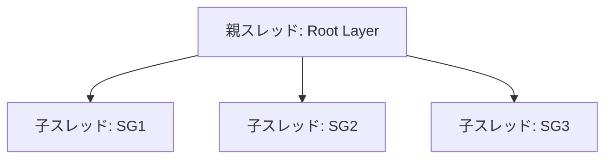
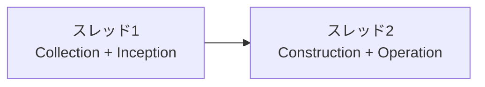
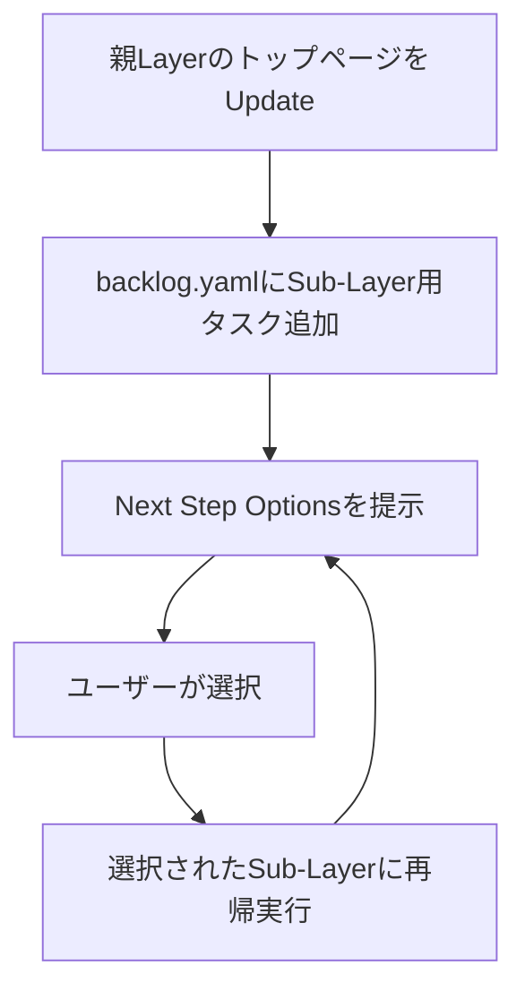

> 🏷️ **Project:** [Project Palma](N/A (Project Palma - Notion))

  **Type:** rule

  **Context:** AI-PLC セッション管理ルール。Claude Code の `.claude/rules/session.md` に相当。セッション分割・マルチスレッド・コンテキスト引き継ぎ・再初期化ルールを定義。

---

## 概要

> 🔀 **Claude Code対応:** `.claude/rules/session.md`


  **旧AIPO対応:** [Untitled](https://www.notion.so/eb08c302f2be4c45bab51761679e59bf)


  **役割:** セッション分割・コンテキスト維持・再初期化の共通ルール


  **ロード方式:** 自動（RUL_plc_systemから参照）

---

## 1. セッション分割トリガー

> 🚨 **問題:** 長いセッションではコンテキストウィンドウから初期の指示が押し出され、品質が劣化する


  **解決:** 以下の閾値で新スレッドへの分割を推奨

| 条件 | 閾値 |
| --- | --- |
| Sub-Layerの数 | 3つ以上 |
| タスク総数 | 10タスク以上 |
| 見積時間 | 2時間超 |
| 階層の深さ | 3階層以上 |

---

## 2. 分割方法

### 方法1: Sub-Layerごとに分割（推奨）



### 方法2: ステージごとに分割



---

## 3. コンテキスト引き継ぎ

### 新スレッドに渡す必須コンテキスト

> 📋 **必ず@mentionで読み込む:**

  1. [AI-PLC system](.claude/skills/ai-plc/README.md) — システム全体
  1. RUL_plc_system — ルートルール
  1. 対象Layerのintent.yaml — Goal定義
  1. 対象Layerのcontext.yaml — Context Manifest

  **Sub-Layerの場合は追加:**

  1. 親Layerのintent.yaml — 親の目標
  1. 親Layerのbacklog.yaml — 兄弟との関係

### 新スレッド起動テンプレート

> 💡 **パターン1: Sub-Layerを新スレッドで開始**


  SKL_plc_01_collection を実行してください


  Goal: [Sub-LayerのGoal]


  親Layer: @[親LayerのURL]

> 💡 **パターン2: 既存Layerのタスク実行を継続**


  SKL_plc_04_operation を実行してください


  Layer: @[対象LayerのURL]


  Task: [タスクID]

---

## 4. 親スレッドへの報告

子スレッド完了時、以下を親スレッドに報告：

> 📤 **報告フォーマット:**


  📤 子スレッド完了報告


  Layer: [Layer ID]


  Status: completed / blocked / partial


  📋 完了サマリー: 完了タスク数 X/Y


  📝 主な成果物: [URL]


  ⚠️ ブロッカー:（あれば）


  💡 学び:（重要な気づき）


  🔜 次のアクション:（推奨）

---

## 5. セッション完了前チェック（必須）

> 🚨 **セッション終了前に必ず実行**

  1. **親Layer確認:** 他に未着手のSub-Layerはないか？
  1. **兄弟Sub-Layer確認:** 今すぐ着手可能なSub-Layerはないか？
  1. **ペンディングTask確認:** 実行可能な残Taskはないか？
  1. **次フェーズ確認:** 先行して構造構築できるものはないか？

### 禁止パターン

- ❌ 残タスクの確認なしに終了する
- ❌ 「他にありますか？」とユーザーに探索を委ねる
- ❌ 一部のSub-Layerだけ確認して終了する

### 正しいパターン

- ✅ 親Layerを確認 → 残タスクを特定 → 「次は○○です」と提案

---

## 6. 再初期化（Update）ルール

> 🔄 **再初期化の鉄則: トップダウン・再帰的・段階的**

  1. トップレベルのみ実行し、Sub-Layerは別タスクとして分解
  1. backlog.yamlに再帰タスクを記録してから実行
  1. 1階層ずつ確認しながら進める
  1. 既存成果物は保持（上書きしない）

### Updateフロー



---

## 7. 出力フォーマット規約（必須）

> 🚨 **全Stage・全Taskの完了報告時に必ず以下の3パートを含めること。**省略禁止。

> ⚠️ **承認ファースト原則（§9.2）が出力順に優先する。** Next Actionを必ず冒頭に配置し、詳細情報はその後に続ける。Cursor/Claude Codeでは長いレスポンスの末尾が表示されないリスクがあるため、ユーザーが最初に目にする位置にアクション選択肢を置くこと。

### 7.1 Next Action Protocol（必須 — 最初に出力）

> 🚨 **全Stage・全Taskの完了報告時に必ず以下のNext Actionブロックを含めること。**省略禁止。**必ずメッセージ冒頭に配置する（§9.2）。**`---` 区切り線で囲んで視覚的に分離すること。

#### 7.1.1 Next Actionの必須構成要素

Next Actionは以下の**3パート構成**で出力する：

1. **選択肢テーブル** — A / B / C 等の選択肢と説明
1. **推奨理由** — なぜその選択肢を推奨するかの理由
1. **コピペ用プロンプト** — ユーザーがそのままコピー&ペーストで実行できるプロンプト

#### 7.1.2 Next Actionテンプレート

🔜 **Next Step**

**次のアクションを選択してください：**

（選択肢を選んだとしても、いきなりは進まず、コピペできるプロンプトを作成します）

| 選択肢 | アクション | 説明 |
| --- | --- | --- |
| A | [次のStage/Taskを実行] | [説明]（⭐ 推奨） |
| B | [代替アクション] | [説明] |
| C | [その他の選択肢] | [説明] |

💡 **推奨: A**

理由:

- [推奨理由を箇条書きで明示]

**📋 選択肢Aのプロンプト（コピペ用）：**

@SKL_plc_XX_name を実行してください

Layer: @[対象Layerページ]

Task: [タスクID]

#### 7.1.3 即実行禁止ルール

> ⚠️ **ユーザーが選択肢を選んだ場合の動作：**


  ✔ **「A」「B」等を選んだ場合も、即座に実行に進まない**


  ✔ 代わりに、**コピペ用プロンプトを生成して返す**


  ✔ ユーザーが**明示的にプロンプトを実行するまで待機**


  **理由:**


  - ユーザーがプロンプトを確認・編集できるようにする

  - 意図しない実行を防ぐ

  - ユーザーのコントロール感を維持

#### 7.1.4 Stage別NextActionテンプレート

**Stage 1（Collection）完了後:**

| 選択肢 | アクション | 説明 |
| --- | --- | --- |
| A | SKL_plc_02_inception を実行 | タスク分解を開始（⭐ 推奨） |
| B | Context情報を追加修正 | 追加の制約条件や参考資料があれば共有 |

プロンプト: `@SKL_plc_02_inception を実行してください Layer: @[Layerページ]`

**Stage 2（Inception）完了後:**

| 選択肢 | アクション | 説明 |
| --- | --- | --- |
| A | SKL_plc_03_construction を実行 | スキル定義を生成（⭐ 推奨） |
| B | backlog.yamlを修正してから実行 | タスク定義を調整したい場合 |
| C | SubLayerのCollectionを先に実行 | SubLayerがある場合 |

プロンプト: `@SKL_plc_03_construction を実行してください Layer: @[Layerページ]`

**Stage 3（Construction）完了後:**

| 選択肢 | アクション | 説明 |
| --- | --- | --- |
| A | SKL_plc_04_operation で最初のタスク実行 | 優先度P0のタスクから開始（⭐ 推奨） |
| B | 全タスク一覧を確認 | Skills/フォルダ内のスキル定義を確認 |

プロンプト: `@SKL_plc_04_operation を実行してください Layer: @[Layerページ] Task: [Task ID]`

**Stage 4（Operation）Task完了後:**

| 選択肢 | アクション | 説明 |
| --- | --- | --- |
| A | 次のタスクを実行 | [Task ID] を実行（⭐ 推奨） |
| B | 親Layerに戻る | 他のSubLayerの状況を確認 |
| C | セッションを終了 | 作業を一時停止 |

プロンプト: `@SKL_plc_04_operation を実行してください Layer: @[Layerページ] Task: [次のTask ID]`

**Stage 4 — Adaptive Backtrack検知時（条件付き追加）:**

Phase 5.5bまたはPhase 6bでBacktrack Trigger条件に該当した場合、上記A/B/Cに加えて以下を出力:

```
🔄 **Adaptive Backtrack 検知:**
| 選択肢 | アクション | 理由 |
| D | Re-Inception（タスク再分解） | [BT-X: 検知理由] |
| E | Re-Collection（ゴール再確認/GAP分析） | [BT-X: 検知理由] |

推奨: [A or D/E] — [推奨理由]
```

D/E選択肢は**BT条件に該当した場合のみ出力する**。該当しない場合は追加しない（ノイズ防止）。
BT条件の詳細は RUL_plc_adaptive §5 を参照。

**全タスク完了時:**

| 選択肢 | アクション | 説明 |
| --- | --- | --- |
| A | 親ScopeBacklogを更新し次のSub-Layerへ | 親Backlogの該当項目をdoneに更新（⭐ 推奨） |
| B | パイプライン完了 | 親ScopeBacklog更新のみ行い、作業終了 |
| D | Goal-Gap Re-Collection | ゴール達成度を検証（BT-7該当時のみ） |

プロンプト: `親ScopeBacklogの[SG ID]をdoneに更新し、次のSub-Layer @[SGページ] のCollectionを開始してください`

#### 7.1.5 プロンプト生成ルール

> ⚙️ **AIへの指示: プロンプト生成時のルール**


  1. **各選択肢に実行用プロンプトを付ける** — メンションを使用（@SKL_plc_XX）、必要なパラメータをプレースホルダで明示

  1. **推奨選択肢を先に提示** — 理由を箇条書きで明示、ユーザーが判断できる情報を提供

  1. **代替選択肢も必ず提供** — 「一度に進めたい」「情報追加」「セッション終了」等のニーズに対応

  1. **プロンプトはコードブロックで囲まない** — メンションが機能する形式で出力

  1. **実際のページ@mentionを使う** — SKL_plc_XXやLayerページは実際のメンションで出力し、ユーザーがそのままコピペできるようにする

### 7.2 現在位置ヘッダー + 完了サマリテーブル（Next Actionの後に出力）

Next Actionブロックの後に、位置情報と完了内容を続ける。

> 📍 **テンプレート:**


  📍 **[Scope ID]** > Stage X: [Stage名] > [Task ID]: [Task名] > Phase Y

| 項目 | 内容 |
| --- | --- |
| Scope | [Scope ID + 名称] |
| 完了対象 | [Stage名 / Task ID / Phase名] |
| 成果物 | [ページリンク or 「なし」] |
| ステータス | [done / partial / blocked] |

### 7.3 進捗ダッシュボード（簡潔に）

Backlog全体の進捗を表示する。タスク数が多い場合は完了済み・次の実行可能タスクのみ表示し、全件列挙しない。

> 📊 **テンプレート:**


  📊 **進捗: X/Yタスク完了（Z%）**


  ✅ T001 方向性具体化 — **done**


  ▶️ T002 世界観設定 — **実行可能**


  ⬜ 残り N タスク（pending）

---

## 8. Phase遷移通知ルール（必須）

> 🚨 **Autonomous Phaseを含む全Phase完了時に、遷移通知を出力すること。**Mob Checkpointだけでなく、Autonomous Phase間の遷移でもユーザーに現在位置を通知する。

### 8.1 Phase遷移通知テンプレート

各Phase完了時に以下の簡易通知を出力する：

> 📍 📍 **[Scope ID]** > Stage X: [Stage名] > **Phase Y: [Phase名] 完了** ✅


  [1-2行の完了サマリ（何を生成/実行したか）]


  → **Phase Y+1: [次Phase名]** に進みます

### 8.2 適用ルール

| Phase種別 | 通知内容 | ユーザー待機 |
| --- | --- | --- |
| Autonomous Phase | 📍 簡易通知（完了サマリ + 次Phase予告） | 不要（通知後そのまま進行）。ただしユーザーが割り込んだ場合は即座に停止 |
| Mob Checkpoint Phase | 📍 簡易通知 + 🙋 承認/選択待ちコールアウト | 必須（ユーザーの応答を待つ） |
| 最終Phase（Stage/Task完了） | セクション7の3パート出力（NextAction→位置+サマリ→進捗） | 必須（NextAction選択を待つ） |

### 8.3 出力例

**例: SKL_plc_01 Phase 2→3→4 の遷移**

> 📍 📍 **L-0407** > Stage 1: Collection > **Phase 2: ディレクトリ構造生成 完了** ✅


  標準フォルダ構造を作成しました（Context/ / Skills/ / sublayers/ / Documents/）


  → **Phase 3: Intent生成** に進みます

> 📍 📍 **L-0407** > Stage 1: Collection > **Phase 3: Intent生成 完了** ✅


  intent.yaml を生成しました（workflow_depth: standard, mode: direct）


  → **Phase 4: Context Collection** に進みます

> 📍 📍 **L-0407** > Stage 1: Collection > **Phase 4: Context Collection 完了** ✅


  Context Store に 3ドキュメント格納（01_[業界動向.md](http://xn--hhrq2aw28bl1k.md/) / 02_[技術スタック.md](http://xn--pcktasq6774d7o5b.md/) / 03_[参考事例.md](http://xn--3kq3x94h0s2d.md/)）


  → **Phase 5: Context Manifest生成** に進みます

### 8.4 なぜ通知が必要か

> 💡 **旧AIPO（CTX_session_rules）からの教訓:**


  - ユーザーは「今AIが何をしているか」を常に把握したい

  - 一気に最終結果だけ出すと「ブラックボックス感」が生まれる

  - Phase遷移ごとに通知することで、ユーザーが途中で方向修正できる

  - 「割り込みポイント」を提供し、ユーザーのコントロール感を維持する

### 8.5 Cursor環境でのPhase遷移通知簡略化

> ⚠️ **Cursor / Claude Code では、Autonomous Phase の遷移通知を最小限にすること。**

  ツールコール（ファイル読み書き・Web検索等）の間に長い通知テキストを挟むと、レスポンス全体が肥大化し最終Phase（Mob Checkpoint）が表示されなくなる。

**簡略化ルール:**

- Autonomous Phase の通知は**インライン1行**で十分: `✅ Phase X 完了 → Phase X+1 に進みます`
- 通知にテーブル・構造ツリー・コードブロックを含めない
- 詳細な成果物一覧はMob Checkpoint（§7.2完了サマリ）に集約する
- Mob Checkpoint以外のPhaseで `---` 区切り線を多用しない

**簡略化後の出力例:**

```
✅ Phase 2 完了 → Phase 3: Intent生成 に進みます
✅ Phase 3 完了 → Phase 4: Context Collection に進みます
✅ Phase 4 完了（Context 4件格納）→ Phase 5 に進みます
```

---

## 9. Mob Checkpoint出力規約（必須）

Mob Checkpoint（ユーザー承認・選択ポイント）では、以下の形式を必ず使用する。

### 9.1 チャット表示の制約

> 🚨 **重要: チャットUIではcalloutブロックは表示されない。**


  Mob Checkpointの出力は全て**基本Markdown**（太字・区切り線・リスト・テーブル）のみで構成すること。


  callout / toggle / columns 等のAdvanced Blockはチャットでは無視される。

> ⚠️ **Cursor / Claude Code 環境固有の制約:**

  - Autonomous Phase（Phase 0-6等）でツールコール（ファイル読み書き・Web検索等）を多数実行すると、レスポンス全体が長大になり**末尾のテキストが表示されないリスク**がある
  - 対策1: Phase遷移通知はインライン1行に収める（§8.5参照）。テーブルや構造ツリーをAutonomous Phase通知に含めない
  - 対策2: Mob Checkpoint（Next Action選択肢）は必ず**メッセージ冒頭**に配置する（§7.1 + §9.2）
  - 対策3: 進捗ダッシュボードは簡潔に。全タスク列挙ではなく、完了済み + 次の実行可能タスクのみ表示（§7.3）

### 9.2 「承認ファースト」原則

> ⚠️ **Mob Checkpointでは、メッセージの冒頭に承認/選択ブロックを配置する。**


  長い説明の末尾に置くと、チャットUIでスクロールしないと見えず、ユーザーが承認を求められていることに気づかない。


  **構成順序:** ① 承認/選択ブロック → ② 詳細説明（必要なら）

### 9.3 承認待ちテンプレート（Decomposition承認など）

以下の形式を**メッセージ冒頭**に配置する:

```javascript
---
🙋 **承認してください**

→ **OK** — そのまま進行（Backlog生成 → Next Action提示）
→ **修正: [指示]** — 例:「T003とT004を統合して」
→ **差し戻し** — Phase 1からやり直し
---
```

その後に、分解テーブル等の詳細を続ける。

### 9.4 選択待ちテンプレート（複数案提示など）

```javascript
---
🙋 **選択してください**

→ **A** — [説明] → [選択後に何が起きるか]
→ **B** — [説明] → [選択後に何が起きるか]
→ **C** — [説明] → [選択後に何が起きるか]
---
```

### 9.5 Mob Checkpointルール

- **冒頭配置必須** — 承認/選択ブロックはメッセージの最初に出す（末尾ではない）
- **区切り線で囲む** — `---` で囲んで視覚的に目立たせる
- **選択肢を明示** — 「どうしますか？」だけで終わらない。具体的な応答例を示す
- **推奨案にマーク** — 推奨がある場合は `⭐ 推奨` を付ける
- **Forward Look必須** — 各選択肢に「選んだ後に何が起きるか」を1行で明示する
- **callout禁止** — チャットではcalloutが表示されないため、太字 + 区切り線 + リストで代替する

### 9.6 Forward Look ルール（必須）

**Mob Checkpointの各選択肢には「選んだ後に何が起きるか」を必ず明示する。**

ユーザーが判断するために、承認後の次ステップの見通しが不可欠。

**承認待ちの場合:**

```javascript
→ **OK** — [承認後に何が起きるか: 成果物作成 / ステータス更新 / 次Phase等]
→ **修正: [指示]** — [修正後の再提示フロー]
→ **差し戻し** — [どこに戻るか]
```

**なぜForward Lookが必要か:**

- ユーザーは「承認したら何が起きるか」を知らないと判断できない
- ブラックボックス感の排除（§8.4の原則と同じ）
- 承認＝次の自律実行への委任なので、委任内容を事前に明示する

---

## 旧CTX対応表

| RUL_plc_session | CTX_session_rules | 変更内容 |
| --- | --- | --- |
| 分割トリガー | 分割トリガー | 語彙変更のみ |
| コンテキスト引き継ぎ | fork_context | ファイル名をモダン用語に更新 |
| セッション完了前チェック | session_completion_check | 語彙変更のみ |
| 再初期化ルール | reinit_rules | 語彙変更 + Mermaidフロー追加 |

---

## 参照元

- [Untitled](https://www.notion.so/eb08c302f2be4c45bab51761679e59bf) — 旧版ルール（対応元）

---

**作成日:** 2026-04-07

**ステータス:** Active

**バージョン:** 1.0