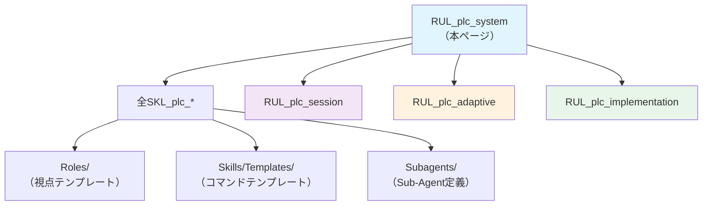

> 🏷️ **Project:** \[YOUR_PROJECT\]
> **Type:** rule
> **Context:** AI-PLC ルートシステムルール。Claude Code の [CLAUDE.md](http://CLAUDE.md) に相彔。全SKLが暗黙的に参照する共通実行ルール・成果物構造標準・Context Cascade伝播定義を含む。
---
## 概要
> 📏 **Claude Code対応:** `CLAUDE.md`（ルートシステム設定）
>
> **役割:** 全SKL・全RULが暗黙的に参照するルートルール
>
> **ロード方式:** 自動（全スキル実行時に自動読み込み）
AI-PLCパイプラインの全スキルが従う**共通実行ルール**を定義する。プロジェクト横断で適用される基盤設定。
---
## 1. AI-PLCの目的
> 🚨 **AI-PLCの目的は「実際に動く成果物」を作ること**
>
> - ガイド/設計書「だけ」では完了にならない
>
> - 実装系タスクは必ずNotion機能で実装（Database・Form・ページ作成）
>
> - タスク完了前に「成果物は作成されたか？」を確認
>
> - セッション終了時に作成した成果物の数を報告
---
## 2. Context Cascade（CC）伝播ルール
> 🔗 **Context Cascadeの3分類継承**
>
> AI-PLCの核心原理。親Layer→子Layerへのコンテキスト伝播を3つのカテゴリで管理する。
| **カテゴリ** | **伝播ルール** | **例** | **Claude Code対応** |
| --- | --- | --- | --- |
| **global_immutable** | 親→子に不変伝播。子は変更不可 | vision, tech_stack, core_principles | [CLAUDE.md](http://CLAUDE.md) のルートルール |
| **overridable** | 親→子に伝播するが、子がオーバーライド可能 | deadline, scope, priority | .claude/rules/ のプロジェクト別ルール |
| **local_only** | そのLayerのみ。子には伝播しない | implementation_details, local_variables | スキル内のローカル設定 |
### CC伝播の実装ルール
1. **Intent（旧layer.yaml）に3分類を明記**
2. **Sub-Layer作成時に親のglobal_immutableを自動継承**
3. **overridableは子がオーバーライドした場合のみ上書き**
4. **local_onlyは子に絶対に伝播しない**
---
## 3. 成果物ページ構造標準
> 🎨 **全Layerページの標準構造**
>
> AI-PLCで構築される全ての成果物ページは、以下の2層構造に従う：
> 1. **成果物セクション（上部）** — ユーザー向けコンテンツ
> 2. **AI-PLC管理セクション（下部）** — 実行管理ファイル群（**必ずトグルで折りたたみ**）
### ページ構造テンプレート
```markdown
# [Layer名]

<callout>
	Goal: [目標の一行要約]
	対象: [誰向けか] ｜ Owner: [owner] ｜ 期限: [deadline]
</callout>

## [成果物セクション]
<!-- ユーザー向けコンテンツ -->

---

▶### 🔧 AI-PLC管理（[Layer ID]）
	> Layer ID: [L-XXXX] ｜ Parent: [親Layer]
	> Status: [active/completed] ｜ Owner: [owner]
	
	<page>intent.yaml</page>    <!-- 旧 layer.yaml -->
	<page>context.yaml</page>   <!-- Context Manifest -->
	<page>backlog.yaml</page>   <!-- 旧 tasks.yaml -->
	<page>variables.yaml</page>
	<page>Skills/</page>        <!-- 旧 Commands/ -->
	<page>Context/</page>       <!-- Context Store -->
```
### 必須配置ファイル
| **ファイル/フォルダ** | **旧AIPO名** | **Claude Code対応** | **必須** | **アイコン** |
| --- | --- | --- | --- | --- |
| **intent.yaml** | layer.yaml | — | ✅ | 📋 |
| **context.yaml** | context.yaml | Memory Bank | ✅ | 📚 |
| **Context/** | Context/ | Memory Bank実体 | ✅ | 📖 |
| **backlog.yaml** | tasks.yaml | — | ✅ | ✅ |
| **variables.yaml** | variables.yaml | — | ⭕ | 🔢 |
| **Skills/** | Commands/ | .claude/skills/ | ⭕ | ⚙️ |
| **Rules/** | —（新規） | .claude/rules/ | ⭕ | 📏 |
| **Subagents/** | —（新規） | [AGENTS.md](http://AGENTS.md) | ⭕ | 🤖 |
| **Documents/** | Documents/ | — | ⭕ | 📄 |
---
## 4. Mob Checkpoint 共通ルール
> 🙋 **全スキル共通のMob Checkpointルール**
> 1. **各Mob Checkpointでは必ず人間のアクションを待つ**
> 2. 人間の返答があるまで次のPhaseに進まない
> 3. 承認パターン: `OK` / `修正指示` / `スキップ`
> 4. チーム（Mob）での判断を標準オプションとして提供
---
## 5. スキル参照チェーン

---
## 6. 命名規則
| **種別** | **プレフィックス** | **例** | **Claude Code対応** |
| --- | --- | --- | --- |
| スキル（実行可能） | `SKL_plc_` | SKL_plc_01_collection | .claude/skills/ |
| ルール（自動ロード） | `RUL_plc_` | RUL_plc_system | .claude/rules/ + [CLAUDE.md](http://CLAUDE.md) |
| ロール（視点） | `ROL_plc_` | ROL_plc_product_manager | — |
| サブエージェント | `AGT_plc_` | AGT_plc_research | [AGENTS.md](http://AGENTS.md) |
---
## 7. 🧠 Persistent Memory ルール
> 🧠 **セッション横断の記憶機構**
>
> `.notion`配下の3ファイルを通じて、プロジェクト横断で知見・アイデンティティ・ユーザーモデルを維持する。
### 読み取りルール
- セッション開始時、Instructionから@mention経由で自動ロード
- SKL実行時、[memory.md](https://www.notion.so/e96fb8b4f56146b4b5a5a946262d710d)の関連セクションを参照して過去の知見を活用
- [Notion page](https://www.notion.so/3b7736201a6f4d71b118061d409c804d)の行動原則に常に従う
- [user.md](https://www.notion.so/ab17cd3d928c4a3696849cebcd922072)のユーザーモデルに基づいて対応を調整
### [memory.md](http://memory.md)書き込みルール
**追記条件（**[**以下の場合にmemory.md**](http://以下の場合にmemory.md)**に追記）:**
1. バグを発見・修正したとき → 「AI-PLC運用知見」に追記
2. ユーザーの新しい判断パターンを学んだとき → 「ユーザーの判断パターン」に追記
3. PJ横断で再利用可能なパターンを発見 → 「PJ横断の学び」に追記
4. 実行環境固有の制約・Tipsを発見 → 「ツール固有の知見」に追記
**フォーマット:** `- [YYYY-MM-DD] [カテゴリ] [1行要約]`
**制約:** 既存エントリと重複しない。１セッションで最大5件まで。
---
## 8. 🔄 Post-Deliver Propagation ルール（スキップ禁止）
> 🚨 **このセクションはSKL_plc_04_operationのPhase 7として必ず実行される。スキップ禁止。**
>
> 各チェック項目を「確認→判断→結果出力」の3ステップで処理すること。
>
> 「確認せずにスキップ」は禁止。確認した結果「該当なし」と判断した場合のみスキップ可。
### チェックリスト（Phase 7出力テンプレート）
SKL_plc_04_operation Phase 7では、以下のチェックリストを**必ず出力**すること:
```javascript
📋 Phase 7: Propagation チェックリスト
- [x] backlog.yaml更新 — [タスクID] status → completed + Output: [成果物パス]
- [x] context.yaml更新 — 成果物エントリ [ファイル名] を追加
- [x] memory.md — [追記内容 or 「新規知見なし — スキップ」]
- [x] user.md — [更新内容 or 「変更なし — スキップ」]
- [x] External Sync — [sync_targets確認: 「未定義→スキップ」 or 「push実行: N件」]
- [x] Wiki波及更新 — [更新内容 or 「新規性なし — スキップ」]
- [x] log.md — [エントリ追加 or 「Wiki更新なしのためスキップ」]
- [x] Project Registry DB — [「未完了タスクあり→スキップ」 or 「全完了→completed更新」]
```
### 各項目の詳細
- [ ] **backlog.yaml:** タスクstatus → completed + Outputリンク追加
- [ ] **context.yaml:** 成果物エントリ追加（ドキュメント名 + サマリー）
- [ ] **PJトップページ:** 進捗・成果物セクションの更新
- [ ] [**memory.md**](http://memory.md)**:** セッション中に学んだ知見があれば追記（確認必須。なければ「新規知見なし」と出力）
- [ ] [**user.md**](http://user.md)**:** 新しい好み・パターンがあれば更新（確認必須。なければ「変更なし」と出力）
- [ ] **External Sync:** intent.yamlの`sync_targets`を**必ず読み込んで確認**。定義があれば同期実行、なければ「未定義→スキップ」と出力
- [ ] **Wiki波及更新:** 成果物から得た知見を`.notion/wiki/`の関連トピックに追記 + バックリンク追加 + [log.md](http://log.md)更新（§11参照）。新規性なければ「新規性なし」と出力
- [ ] **Project Registry DB更新:** PJ全タスク完了時のみ、[AI-PLC Projects DB](https://www.notion.so/8f5680ace0254d3e9d82c260b4a1fc73) DBの該当PJのステータスを「completed」に更新
### §18 3層検証との連動
Phase 7（Propagation）の前に、必ず**Phase 5.5: Verification（§18準拠の3層検証）**を実行すること。検証が完了していない成果物についてPropagationを実行してはならない。
**タイミング:** SKL_plc_04_operationのPhase 5.5（Verification）→ Phase 6（Status Update）→ Phase 7（Propagation）の順で必ず実行。
---
## 9. 🔗 External Sync 仕様（v2: コンテキスト付きタスク委譲）
> 🔗 **PJ内で発見したが今実行しないタスクを、別の実行者が独立実行できる形で外部に書き出す機構。**
>
> intent.yamlの`sync_targets`で同期先を宣言。タスクにはSelf-Describing構造（生成元コンテキスト・読むべきドキュメント・制約・完了基準）を付与し、
>
> そのチケットだけ見れば誰でも実行できる状態にする。
### External Syncの2つの役割
| **役割** | **説明** | **例** |
| --- | --- | --- |
| 📤 **タスク委譲**（Task Delegation） | PJ内で発見したが今実行しないタスクを、コンテキスト付きで外部に書き出す | 開発チケット、デザイン依頼、別PJ波及 |
| 🔄 **ステータス同期**（Status Sync） | backlog.yamlのステータス変更を外部DBに反映 | Notion DB・Linear・GitHub Issuesの更新 |
### タスク委譲が発動するケース
| **ケース** | **発動タイミング** | **誰向け** | **例** |
| --- | --- | --- | --- |
| 🔴 **開発チケット委譲** | Stage 2 Inception / Stage 3 Construction | エンジニア | APIエンドポイント追加 → Linear Issue |
| 🟡 **次フェーズ先送り** | Stage 4 Operation Propagation時 | 未来の自分/AI | デザインリファクタ → backlogに残す |
| 🟡 **別PJ波及** | Stage 4 Propagation時 | 別PJオーナー | PJ-AのDB設計変更をPJ-Bにも適用 |
| 🔵 **外部チーム依頼** | 任意のタイミング | パートナー/外注 | デザイン素材作成依頼 |
| 🔵 **定期レビュー用蓄積** | 運用中に改善点発見 | プロダクトオーナー | UX改善ポイント → Product Backlog |
### Self-Describing Task 構造（委譲チケットの必須フィールド）
> 📝 **そのチケットだけ見れば、どんなコンテキストから生まれたタスクかがわかる状態にする。**
```yaml
# External Syncで書き出すタスクの構造
title: "APIエンドポイント追加: /api/v2/analysis"
description: "分析結果を返すREST APIエンドポイントの実装"

context:                                # 生成元コンテキスト
  source_project: "[YOUR_PROJECT]"       # どのPJから生まれたか
  source_layer: "SG2"                   # どのLayerから
  source_task: "T015"                   # どのタスク実行中に発見したか
  decision_ref: "[設計ドキュメント名]"    # 判断根拠ドキュメント

related_docs:                           # 読むべきコンテキスト
  - "[アーキテクチャ設計書 §X]"
  - "[API仕様書 vX.X]"

constraints:                            # 制約・前提
  - "既存v1 APIとの後方互換性を維持"
  - "レスポンスタイム < 200ms"

acceptance_criteria:                    # 完了基準
  - "エンドポイントが正常にレスポンスを返す"
  - "テストカバレッジ 80%以上"

priority: "high"
due_date: "2026-04-15"                  # 任意
```
**Notion DBへのマッピング例:**
- `title` → タスク名（titleプロパティ）
- `description` + `context` + `related_docs` + `constraints` → ページ本文にコールアウトで配置
- `acceptance_criteria` → ページ本文にチェックリストで配置
- `priority` → 優先度プロパティ
- `due_date` → 期限プロパティ
### sync_targets スキーマ
```yaml
# intent.yaml 内の sync_targets 定義
sync_targets:
  - type: notion_db          # 同期先タイプ
    target_url: "db-url" # 同期先URL/ID
    mapping:                 # backlog → 外部プロパティ対応
      title: "Name"          # タスク名
      status: "Status"       # ステータス
      output: "Output"       # 成果物リンク
    status_map:              # ステータス値の変換
      pending: "Not started"
      in_progress: "In progress"
      completed: "Done"
      blocked: "Blocked"
    auto_create: false       # 新タスク自動作成
    sync_direction: push     # push / pull / bidirectional
```
### 対応する同期先タイプ
| **type** | **同期先** | **Notion AI** | **Claude Code** | **Cursor** |
| --- | --- | --- | --- | --- |
| `notion_db` | Notion Database | ✅ queryDataSource + updatePage | ❌ API不可 | ❌ API不可 |
| `linear` | Linear Issues | ⚠️ MCP経由 | ✅ Linear MCP / API | ✅ Linear MCP |
| `github_issues` | GitHub Issues | ⚠️ MCP経由 | ✅ `gh` CLI | ✅ `gh` CLI |
### External Sync 実行手順
1. **intent.yamlのsync_targetsを読み込む**
2. **sync_targets が空 → スキップ**（ログ出力のみ）
3. **各sync_targetに対して:**
	- backlog.yamlの更新されたタスクを特定（直前のDeliver対象）
	- `mapping`に従い外部プロパティにマッピング
	- `status_map`でステータス値を変換
	- `sync_direction`に従い同期実行:
		- **push:** backlog → 外部に書き込み
		- **pull:** 外部 → backlogに読み込み（手動トリガーのみ）
		- **bidirectional:** 最終更新タイムスタンプで競合解決
4. **auto_create=true の場合:** backlogに新タスクが追加されたとき外部にもアイテム作成
5. **同期結果をログ出力:**「✅ External Sync: \[type\] \[target\] — \[タスクID\] を \[ステータス\] に更新」
### デフォルトsync_target
`sync_targets`が未設定（空配列）の場合、`.notion`配下のデフォルトTask DBを自動適用する:
```yaml
# デフォルトsync_target（sync_targetsが空のとき自動適用）
sync_targets:
  - type: notion_db
    target_url: "https://www.notion.so/a4df4cf09a5841a4817a284f76b8d9f0"  # .notion/AI-PLC Tasks
    mapping:
      title: "タスク名"
      status: "ステータス"
      output: "成果物"
    status_map:
      pending: "未着手"
      in_progress: "進行中"
      completed: "完了"
    auto_create: true
    sync_direction: push
```
**デフォルトDB:** [AI-PLC Tasks DB](https://www.notion.so/a4df4cf09a5841a4817a284f76b8d9f0)（`.notion`配下）
### 参考実装: 外部Backlog DBとの連携
外部のタスク管理DBとの連携パターン:
```yaml
sync_targets:
  - type: notion_db
    target_url: "[YOUR_BACKLOG_DB_URL]"
    mapping:
      title: "タスク名"
      status: "ステータス"
      output: "成果物"
    status_map:
      pending: "未着手"
      in_progress: "進行中"
      completed: "完了"
      blocked: "ブロック"
    auto_create: true
    sync_direction: push
```
---
## 10. 🧹 Knowledge Lint ルール
> 🧹 **Karpathy Second BrainのLintワークフロー。**
>
> `.notion/wiki/`配下の知識ベースの健全性を月次で検証する。
>
> **実行タイミング:** SKL_plc_04_operation Phase 8 として実行。月次推奨。
>
> **環境別実現:** Notion→カスタムエージェント定期実行 / CC→cron
### Lintチェックリスト（5項目）
- [ ] 🔴 **矛盾検出** — `> ⚠️ CONTRADICTION:` フラグがあるページを特定し、既存知見との不整合を検証
- [ ] 🟡 **孤立ページ検出** — 他のトピックからのバックリンクがないページを特定
- [ ] 🟡 **引用なしチェック** — 「Source:」記載がない事実主張を検出
- [ ] 🔵 **未説明概念** — 他ページで言及されているが専用トピックがない概念を特定
- [ ] 🔵 **欠落相互参照** — 関連すべきトピック間のリンクが欠落しているペアを検出
### Lintレポート出力形式
レポートは `.notion/wiki/lint-report-YYYY-MM.md` として作成。以下のフォーマットに従う:
```markdown
# Knowledge Lint Report - YYYY-MM

## 🔴 Errors（要対応）
- CONTRADICTION: [トピック名] — [矛盾内容の説明]

## 🟡 Warnings（推奨対応）
- ORPHAN: [トピック名] — バックリンクなし
- NO_SOURCE: [トピック名] > [主張内容] — Source未記載

## 🔵 Info（改善提案）
- UNDEFINED: [概念名] — [言及元トピック]で使用されているが専用ページなし
- MISSING_LINK: [トピックA] ↔ [トピックB] — 相互参照欠落

## 📊 Summary
- Total pages: X
- 🔴 Errors: X
- 🟡 Warnings: X
- 🔵 Info: X
- 推奨アクション: [最優先の3件]
```
### 知識ギャップ提案
Lintレポートの末尾に「知識ベースのギャップを埋めるために読むべき3記事」を提案する（Karpathy方式）。
---
## 11. 🌊 Wiki波及更新ルール（Ingest Ripple）
> 🌊 **Karpathyの「1ソースが10-15 wikiページにタッチ」原則。**
>
> 新しい情報を収集・生成したとき、関連する既存wikiトピックページに波及更新する。
### 発動タイミング
- **SKL_plc_01_collection Phase 4.5** — Context収集後の知見波及
- **SKL_plc_04_operation Phase 7 Propagation** — Deliver後の成果物知見波及
### 波及更新手順
1. [**index.md**](http://index.md)**を読み込み** — 全トピックの一覧を把握
2. **関連トピックを特定** — 新情報のキーワード・カテゴリから該当トピックを選定
3. **既存トピックに追記** — フォーマット: `- [YYYY-MM-DD] [Source: 収集元] [内容]`
4. **バックリンク追加** — 更新したトピックの「関連トピック」セクションに相互リンクを追加
5. **新規トピック作成**（必要な場合） — frontmatter付きで作成、[index.md](http://index.md)に行追加
6. [**log.md**](http://log.md)**にエントリ追加** — `| YYYY-MM-DD | ingest | [ソース名] | [影響トピック数]トピック更新 |`
7. **frontmatter更新** — 影響を受けたトピックの`last_updated`と`source_count`を更新
### スキップ条件
- 収集した情報が既存wiki知見の範囲内で新規性がない場合
- Adaptive WorkflowがSimpleで、wiki更新が不要な単純タスクの場合
### バックリンク自動追加ルール
> 🔗 **wikiトピックページを更新したら、必ずバックリンクを確認:**
> 1. 更新したトピックの「関連トピック」セクションに、今回のソースに関連する他トピックへのmention-pageがあるか
> 2. 逆方向のバックリンクも確認（A→Bを追加したらB→Aも確認）
> 3. 新規トピック作成時は、関連する既存トピック全てにバックリンクを追加
---
## 12. ⚠️ 矛盾検出・フラグ機構（CONTRADICTION）
> ⚠️ **KarpathyのCONTRADICTIONフラグ機構。**
>
> 新情報が既存知見と矛盾する場合、即座に削除せずフラグを立てて両方を保持する。
>
> 月次Knowledge Lint（§10）で自動検出される。
### CONTRADICTION記法標準
矛盾を発見したら、該当トピックページの矛盾箇所の直下に以下のブロッククォートを挿入:
```markdown
> ⚠️ CONTRADICTION: [既存主張の要約] vs [新情報の要約]
> Source: [新情報の出典]
> Date: YYYY-MM-DD
> Status: open | resolved | superseded
```
### 矛盾発見時のフロー
1. **既存知見を削除しない** — 両方の主張を保持
2. **CONTRADICTIONブロッククォートを挿入** — 既存主張の直下に配置
3. **Status: openで作成** — 解決は人間の判断を待つ
4. [**log.md**](http://log.md)**に****`contradiction`****エントリ追加** — `| YYYY-MM-DD | contradiction | [トピック名] | [矛盾内容要約] |`
5. [**index.md**](http://index.md)**の該当トピック行に⚠️マーク追加**
### 解決フロー
オーナーが矛盾を解決したら:
1. **Statusを****`resolved`****または****`superseded`****に変更**
2. **解決理由を追記** — `> Resolution: [解決内容] (YYYY-MM-DD)`
3. **廃止された主張に取り消し線を追加**（削除はしない）
4. [**index.md**](http://index.md)**の⚠️マークを除去**
### wikiトピックページテンプレート（推奨構造）
```markdown
---
status: active
source_count: N
created: YYYY-MM-DD
last_updated: YYYY-MM-DD
---

## 知見
- [YYYY-MM-DD] [Source: xxx] [内容]
- [YYYY-MM-DD] [Source: xxx] [内容]

## 矛盾・未解決
<!-- CONTRADICTIONブロッククォートがあればここに集約 -->
※ 矛盾がない場合はこのセクションを省略可

## 関連トピック
- mention-pageで相互リンク
```
---
## 13. 🔄 Query知識還元ループ（Query Return）
> 🔄 **Karpathyの「Query結果をwikiに還元」ループ。**
>
> Deliver中の調査・分析・Context収集で得た有価値なQuery結果をwikiに自動ファイルする。
>
> **実行タイミング:** SKL_plc_04_operation Phase 7 Propagationの一部として実行。
### 有価値Query結果の判定基準
以下のいずれかに該当するQuery結果をwikiに還元する:
| **カテゴリ** | **説明** | **例** |
| --- | --- | --- |
| 🔴 **比較分析** | 複数の選択肢を比較した結果 | AI-PLC vs AI-DLC比較、CC構造 vs .cursorrules |
| 🟡 **新見解** | 既存知見を更新・拡張する情報 | Karpathy手法の新しい適用パターン |
| 🔵 **接続発見** | 異なるトピック間の予想外の接続点 | 外部ツールのWFとAI-PLC Adaptive Workflowの対応関係 |
### Query還元フロー
1. **Deliver完了時に有価値Queryを判定** — 上記カテゴリに該当するか確認
2. **該当トピックに追記** — §11 Ingest Ripple手順に従う
3. **新規トピックが必要なら作成** — 十分なボリュームがある場合のみ
4. [**log.md**](http://log.md)**に****`query-return`****エントリ追加** — `| YYYY-MM-DD | query-return | [タスクID] | [還元先トピック] |`
### スキップ条件
- 単純な事実確認のみのQuery（「このAPIのエンドポイントは？」等）
- 既存wikiトピックに既に含まれている情報
- PJ固有のローカル情報（wikiに載せる価値がない）
### Post-Deliver Propagationとの関係
§8 Propagationチェックリストの「Wiki波及更新」（§11）内で実行する。別ステップではなく、Wiki波及更新の「判定基準強化」として位置づけ。
---
## 14. 📝 ページ作成デフォルトルール
> 📝 **新しいページやメモを作成する際の共通ルール。**
### デフォルト配置先
特に指定がない場合、**Flow/の該当する日付フォルダ配下**に作成する。
- 月フォルダ: `YYYYMM` 形式（例: 202604、icon: 📅）
- 日付フォルダ: `YYYY-MM-DD` 形式（例: 2026-04-07、icon: 🗓️）
- 該当フォルダがなければ作成、あればその中に配置
### フロントマター（全ページ先頭に必須）
全てのページの先頭に以下のコールアウトを配置:
```markdown
> 🏷️ **Project:** （projects配下の該当ページを@mention）
> **Type:** memo / meeting / decision / draft
> **Context:** （1行で目的・背景）
```
- **Projectは必須** — 不明なら`Project: TBD`とし、後で埋める
- **コードブロックではなくコールアウト形式**を使う（編集しやすさ・見た目の統一）
### プロジェクト参照ルール
- 顧客名やPJ文脈は**projects配下のProjectページを@mention**で参照
- 外部URLリンクは貼らない（必要ならテキスト表記のみ）
---
## 15. 🤖 自律的動作フロー
> 🤖 **GOALを理解し、自律的に最適な手段を選んで実行する。**
### 指示の優先順位
1. **明確な指示がある場合** → 最優先で従う。疑問があってもまず指示通りに動く
2. **不明確な場合** → 以下のステップで自律的に動く:
	- ユーザーの意図とGOALを推測
	- コンテキスト収集（§16の優先順位に従う）
	- AI-PLCのSkillsから該当スキルを探索
	- 見つかればスキル実行、なければ柔軟に対応
### GOAL達成後のパターン化
- 今後も繰り返しそうなタスク → Skillsへの型化を検討
- 1回限りの特殊対応 → そのまま完了
---
## 16. 🔍 コンテキスト収集優先順位
> 🔍 **依頼実行前に必ず関連情報を収集。以下の優先順位を必ず守る。**
1. 🔴 **Flow/の日付フォルダ** — 今日の日付フォルダから関連情報を探す
2. 🔴 **Stock/projects** — 関連プロジェクトがないか確認
3. 🟡 **チームスペース** — WS内のチームスペースを探す
4. 🟡 **Slack** — 関連する会話や情報を検索
5. 🔵 **GitHub** — 開発系の依頼ならGitHubを探す
6. 🔵 **Web検索** — 一般的な知識が必要な場合のみ
**原則:** 内部情報（Flow, Stock, チームスペース）を最優先。外部（Slack, GitHub, Web）は不足がある場合のみ。
---
## 17. ⚠️ 実行エラー回避原則
> ⚠️ **NotionのDB操作・大量処理で失敗しやすい状況を避けるための原則。**
1. **一括処理をしない** — 取得も更新も5〜10件の小分けで進める
2. **範囲を絞ってから取得** — LIMIT必須、プレフィクスや日付で対象を絞る
3. **不安定なら既知URLベースに切り替え** — 一覧取得が落ちる場合は既知URL起点
4. **並列更新は控えめに** — まず少数件で成功パターンを確立
5. **再実行可能性を担保** — 移行済み判定を持ち、重複・破壊を避ける
---
## 18. ✅ 汎用検証ステップ（Universal Verification）
> ✅ **全タスク共通の3層検証。**コーディングのUnit Test / Integration Test / E2E Testを汎用化。
>
> タスク種別を問わず、成果物の品質を保証するための標準検証フレームワーク。
>
> **Adaptive Skip連動:** SimpleタスクはLevel 1のみ、StandardはLevel 1-2、Complexは全Level実行。
| **Level** | **名称** | **コーディング対応** | **汎用内容** | **確認観点** |
| --- | --- | --- | --- | --- |
| **L1: セクションチェック** | 部分検証 | Unit Test | 各セクション・各パーツが単体で正しいか | 論理が通っているか？ 根拠はあるか？ 欠落はないか？ |
| **L2: 統合チェック** | 全体検証 | Integration Test | 全体として整合性があるか | 矛盾はないか？ 流れが自然か？ トーンが一貫しているか？ |
| **L3: 受け手チェック** | ユーザー検証 | E2E Test | 受け手が見たときに価値があるか | 知らない人が読んで分かるか？ アクションしたくなるか？ |
### タスク種別ごとの検証例
| **タスク種別** | **L1: セクション** | **L2: 統合** | **L3: 受け手** |
| --- | --- | --- | --- |
| コーディング | 関数単体テスト | モジュール間連携テスト | ユーザー操作フローテスト |
| 企画書 | 各セクションの論理・根拠確認 | 全体のストーリー・矛盾検出 | 意思決定者が読んで判断できるか |
| 記事・ブログ | 事実確認・引用確認 | 読みやすさ・流れの自然さ | ターゲット読者が最後まで読むか |
| イベント企画 | 各準備項目の完全性 | タイムライン・予算・人員の整合性 | 参加者が楽しめるか？ 目的を達成できるか？ |
| DB設計 | 各プロパティの妥当性 | ビュー間・リレーションの整合性 | エンドユーザーが簡単に使えるか |
---
## 19. 📋 汎用NFRチェックリスト（Universal Non-Functional Requirements）
> 📋 **「機能的には正しいが品質が足りない」を防ぐ。**
>
> コーディングのNFR（パフォーマンス・セキュリティ）を全タスクに拡張。
>
> ロール別の追加NFRは各TPL_role_\*に定義。ここは全ロール共通の基本4項目。
| **NFR領域** | **コーディング対応** | **汎用内容** | **確認例** |
| --- | --- | --- | --- |
| **パフォーマンス** | レスポンスタイム | 成果物のサイズ・所要時間が適切か | 読了時間は対象に合っているか？ ページ数は過剰でないか？ |
| **セキュリティ** | 認証・暗号化 | 機密情報・社外秘・個人情報の取り扱い | 社外秘の情報が含まれていないか？ 個人情報は適切に扱われているか？ |
| **アクセシビリティ** | 障害対応 | 専門用語の説明・読みやすさ・前提知識の明示 | 専門外の人が読んで理解できるか？ 略語に説明があるか？ |
| **再利用性** | スケーラビリティ | テンプレート化可能か・次回も使えるか | この成果物は型化できるか？ 次の類似タスクで再利用できるか？ |
---
## 20. 🔌 汎用Extension opt-in（タスク種別追加ルール）
> 🔌 **必要なときだけ追加ルールを有効化する仕組み。**
>
> AI-DLCのExtension opt-inパターンを汎用化。intent.yamlの`extensions`フィールドで宣言。
>
> コーディング用（security-baseline / testing-standards）はRUL_plc_implementation §6.3で定義済み。
### 汎用Extension一覧
| **Extension** | **適用シーン** | **追加されるチェック** | **有効化条件** |
| --- | --- | --- | --- |
| **legal-check** | 契約書・利用規約・法的文書 | 法務チェックリスト（表現の正確性・免責条項・準拠法） | intent.yamlに `extensions: [legal]` |
| **brand-guide** | 外部公開物（Webサイト・プレスリリース・LP） | ブランドガイドライン適合（トーン・用語・ビジュアル） | intent.yamlに `extensions: [brand]` |
| **data-privacy** | ユーザーデータ・個人情報を扱うタスク | 個人情報保護チェック（GDPR/個人情報保護法準拠） | intent.yamlに `extensions: [privacy]` |
| **security-baseline** | コーディングPJ（セキュリティ要件あり） | OWASP Top 10・依存関係スキャン・認証/認可テスト | intent.yamlに `extensions: [security]` |
| **testing-standards** | コーディングPJ（パフォーマンス要件あり） | 負荷テスト・パフォーマンステスト・カオステスト | intent.yamlに `extensions: [testing]` |
### Extension適用フロー
1. **SKL_plc_01_collection時:** intent.yamlのextensionsフィールドを読み込み
2. **各Stageで:** 有効なExtensionの追加チェックを自動適用
3. **検証ステップ（§18）で:** Extension固有のチェック項目をL2またはL3に追加
---
## ⚙️ AIへの実行指示
> 🤖 **このルールは全スキル実行時に自動適用される**
> ### 自動ロードルール
> 1. **SKL_plc_\*が@メンションされたとき**、以下を自動読み込み：
> - RUL_plc_system（本ページ）
> - RUL_plc_session
> - 対象Layerのintent.yaml（旧layer.yaml）
> - 対象Layerのcontext.yaml
> 2. **追加ルールは各SKLの「必須コンテキスト」に記載**
> ### 成果物チェック
> 1. タスク完了前に「成果物は作成されたか？」を確認
> 2. ガイド/設計書だけで完了にしない
> 3. セッション終了時に作成した成果物の数を報告
> ### CC伝播チェック
> 1. Sub-Layer作成時にglobal_immutableが継承されているか確認
> 2. overridableのオーバーライドが明示されているか確認
> 3. local_onlyが子に伝播していないか確認
---
---
**作成日:** 2026-04-07
**ステータス:** Active
**バージョン:** 1.1（§8 Propagationスキップ禁止 + 出力テンプレート + §18連動追加）
